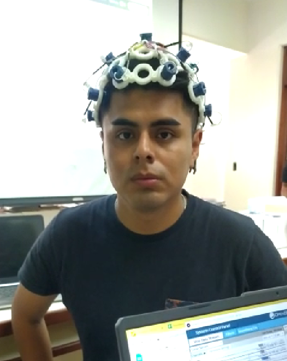
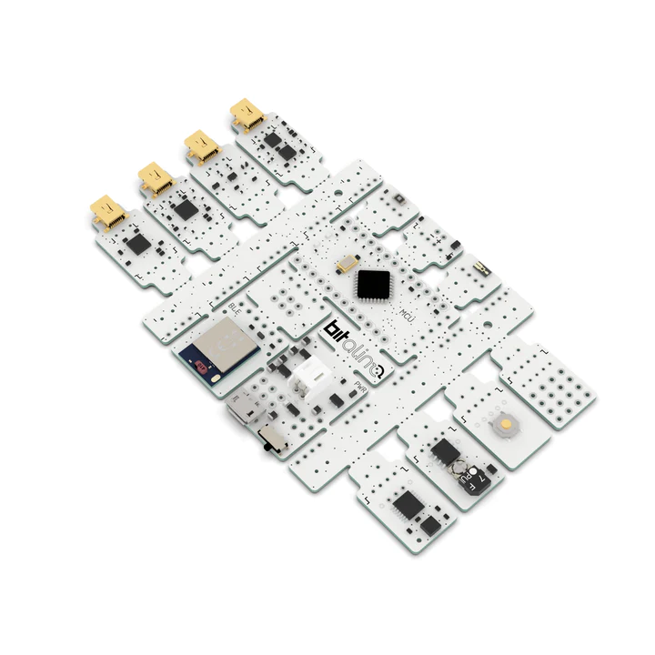
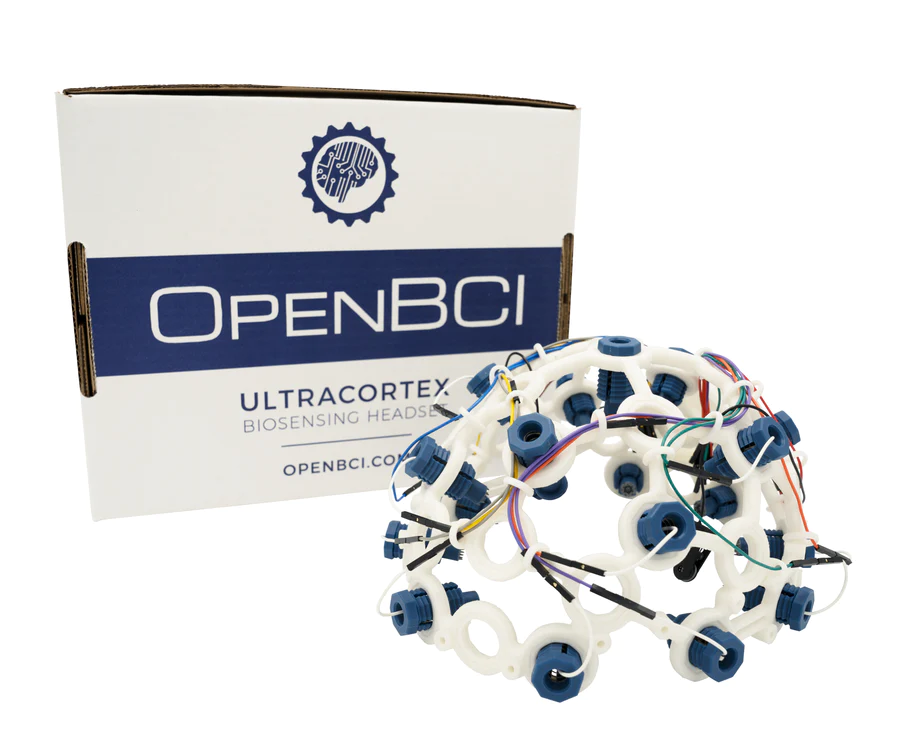

<h1 align="center"> Registros de señales EEG </h1>
Horario 3 - Grupo 13 

Laboratorio 5 - Viernes 21/04/2023

## Integrantes

* Joseph Jesus Melgarejo Castillo -joseph.melgarejo@upch.pe
* Gabriel Adolfo Narvaez Montalvo- gabriel.narvaez@upch.pe
* Mauricio Leonardo Ramos Gallegos -  mauricio.ramos@upch.pe
* Diego Alejandro Celis Matias - diego.celis@upch.pe 
* Ricardo Alonso Muñoz Quiroz- ricardo.munoz@upch.pe
---
## Tabla de Contenidos
* [Introducción](#introducción)
* [Marco Teórico](#marco-teórico)
* [Materiales](#materiales)
* [Objetivos](#objetivos)
* [Conexiones usadas](#conexiones-usadas)
* [Video: Señal Analizada](#señales-analizadas)
* [Señales obtenidas](#ploteo-y-explicación-de-las-señales)
* [Archivos de las señales](#archivos-de-eeg-en-open-bci)
* [Ploteo de la señal en Python](#ploteo-en-python)
---     

## Introducción
En el presente laboratorio se realizó la adquisición, visualización y análisis de señales EEG a través del uso de ULTRACORTEX "MARK IV" de 8 canales y del dispositivo de adquisición de señales ,Bitalino.

Para medir señales EEG con Bitalino, se necesitaron dos electrodos colocados en la cabeza del paciente , a la altura de la frente y uno de referencia  en la parte posterior de la oreja. 

 

<em>
 Fig1. Conexiones de Bitalino.
</em>

Y para  la correcta medición del ULTRA CORTEX se requirió de una correcta calibración de los 8 canales ubicados estratégicamente en la cabeza de nuestro compañero ,de acuerdo con el sistema de colocación de electrodos 10/20.

 

<em>
 Fig2. Conexiones de Ultra Cortex.
</em>

Cabe resaltar que se realizará una posterior evaluación del registro electroencefalográfico a través de una codificación en python, pudiendo así obtener valores de suma importancia como son la amplitud y frecuencia de las distintas mediciones que se realizaron. Apuntaremos a la  identificación de las ondas alfa y beta, y las señales de interferencia.

## Marco Teórico

La señal EEG (electroencefalograma) es una medida de la actividad eléctrica del cerebro, que se obtiene colocando electrodos en el cuero cabelludo del paciente[1]. Algunas de las características de la señal EEG son:

* Frecuencia: La actividad eléctrica del cerebro se puede medir en diferentes frecuencias, que se corresponden con diferentes estados mentales. Estas frecuencias se clasifican en bandas: delta (< 4 Hz), theta (4-8 Hz), alpha (8-13 Hz), beta (13-30 Hz) y gamma (> 30 Hz).

* Amplitud: esta varía en función de la cantidad de neuronas que están sincronizadas en una determinada frecuencia.

* Morfología: La forma de la señal EEG se relaciona con la actividad eléctrica que se está produciendo en el cerebro en ese momento.

* Coherencia: se refiere al grado de sincronización de la actividad eléctrica entre diferentes regiones del cerebro.

* Artefactos: Las señales EEG pueden verse afectadas por artefactos, como el movimiento del paciente, la actividad muscular o los artefactos eléctricos de otros dispositivos cercanos. Es importante identificar y eliminar estos artefactos para obtener una señal EEG limpia y precisa.  

* Otras características a resaltar son su capacidad para registrar la actividad eléctrica del cerebro con alta resolución temporal y su capacidad para medir la actividad cerebral tanto en reposo como durante la realización de una tarea cognitiva específica[2].También existirán ciertas limitaciones, como la necesidad de colocar electrodos en la cabeza del sujeto y la susceptibilidad a los artefactos de la señal, que pueden ser causados por movimientos o actividad muscular y ruidos generados por el mismo cabello del paciente.

Según un paper review de analisis de EEG la actividad eléctrica será medida en voltios en diferentes puntos del cerebro a traves de distintos tipos de tecnicas de procesamiento de señales , esto nos permitirá arrojar data estadistica a cerca de las ondas cerebrales que existen y su relación con un numero variable de patologías[3]: Ondas delta, theta, alfa , beta y gamma, siendo entre las principales a encontrar en este laboratorio  las alfa y beta, puesto que estas son medibles  en un estado de relajación y alerta , y de actividad mental intensa como concentración , pensamiento  o resolución de problemas . Cabe resaltar que todas estas tienen relación con distintas patologías y con una buena lectura y analisis de señal se podria detectar, diagnosticar y monitorear una variedad de trastornos neurológicos, incluyendo epilepsia, trastornos del sueño, enfermedades cerebrales degenerativas, traumatismo craneal y trastornos psiquiátricos.

 

<em>
 Fig3. Ondas cerebrales.
</em>
 
## Materiales
Los materiales usados para el desarrollo de este laboratorio fueron 2 dispositivos capaces de medir señales de biopotenciales EEG, además fue necesario el uso de una laptop para poder registrar las señales tomadas por ambos dispositivos.

|Materiales |   Descripción      |Referencia         |
|:---       |    :---:           |     :---:         |
| Laptop    | PC portatil        | Cualquier modelo  |
| Bitalino  |Kit de herramientas de prototipado rápido para proyectos de salud y bienestar personal, para adquirir, procesar y visualizar datos biomédicos.| <em>
 Fig4. Bitalino.
</em>|
|Ultracortex EEG Headset |Dispositivo portátil que se coloca en la cabeza para medir la actividad eléctrica del cerebro y permitir la monitorización y análisis de las ondas cerebrales en tiempo real.   | <em>
 Fig5. Ultracortex EEG Headset.
</em>|

<h1 align="center"> Desarrollo del laboratorio </h1>

## Objetivos

* Poder adquirir y analizar señales EEG
* Emplear el software OpenBCI y usar el dispositivo Ultracortex para la toma de señales
* Realizar una segunda medición con el software Bitalino

## Conexiones usadas

Para la toma de muestras, fueron necesario 2 pacientes de prueba para el uso de bitalino y del ultracortex.
Las conexiones que se le hicieron a cada paciente de prueba fueron las siguientes:

|Paciente de prueba 1| Paciente de Prueba 2|
|:---:               |                :---:|
|   Gabriel Narvaez  |     Diego Celis     |
| <em>
 Fig6. Conexiones señaladas de Bitalino.
</em> |    <em>
 Fig7. Conexiones de Ultra Cortex según sistema 10/20.
</em> |

## Señales Analizadas
    
<h2 align="center"> Toma de regitros con Bitalino </h2>

<em>
 Fig8. Registros de ejercicios de Bitalino.
</em>

### 1. Registro de linea basal (30 segundos)
Este registro consiste en la toma de muestra de señal EEG donde el usuario uno permaneció durante 30 segundos en reposo, con los ojos cerrados, sin ninguna distracción y con una respiración normal.

    <video src="https://user-images.githubusercontent.com/43487731/233764056-4be7901f-acf7-4714-8eb8-6fc3955dc434.mp4">

<em>
 Video1. Ejercicio1 en Bitalino.
</em>

### 2. Registro de ciclo Ojos abiertos - Ojos cerrados
Este registro consiste en la toma de muestra de señal EEG donde el usuario realizó un ciclo de parpadeo 5 veces. Cada momento en el que el usuario permanece con los ojos cerrados o con los ojos abiertos durará 5 segundos.

    <video src="https://user-images.githubusercontent.com/43487731/233763534-fe27df17-2006-4958-ab02-ca933bbe7df9.mp4">

<em>
 Video2. Ejercicio2 en Bitalino.
</em>
    
### 3. Registro de fase de referencia
Registro de reposo, similiar al primer registro, durante 30 segundos.

### 4. Registro cálculo de ejercicios matemáticos
Último registro, nuestro usuario se encargará de resolver una lista de ejercicios matemáticos mentalmente, mirando hacia un solo punto fijo para evitar distracciones.
Esta lista de ejercicios será dictada con la ayuda de una segunda persona que los dirá en voz alta

    <video src="https://user-images.githubusercontent.com/43487731/233763662-c3e35430-3325-47bf-89e0-ea0fde7ad094.mp4">

<em>
 Video4. Ejercicio4 en Bitalino.
</em>
 
<h2 align="center"> Toma de regitros con OpenBCI </h2>

<em>
 Fig9. Registros de ejercicios en OpenBCI.
</em>

Se realizaron los mismos ejercicios de registro de señales con el uso del UltraCortex y el software OpenBCI
### 1. Registro de linea basal (30 segundos)
    

    <video src="https://user-images.githubusercontent.com/43487731/233763713-8d193e2f-f4f3-4107-8bb1-1f2c6d079269.mp4">

<em>
 Video5. Ejercicio1 en OpenBCI.
</em>
    
### 2. Registro de ciclo Ojos abiertos - Ojos cerrados

    <video src="https://user-images.githubusercontent.com/43487731/233763726-240f3828-6a1c-4c83-b967-e193d5d2ba87.mp4">

<em>
 Video6. Ejercicio2 en OpenBCI.
</em>
    
### 3. Registro de fase de referencia

    <video src="https://user-images.githubusercontent.com/43487731/233763735-f9dc003b-4697-4509-9541-d675d6b5caeb.mp4">

<em>
 Video7. Ejercicio3 en OpenBCI.
</em>

### 4. Registro cálculo de ejercicios matemáticos

    <video src="https://user-images.githubusercontent.com/43487731/233763746-8726fe83-8f0f-4731-b614-441f866f0424.mp4">

<em>
 Video8. Ejercicio4 en OpenBCI.
</em>
    
## Ploteo y Explicación de las señales
    Explicaciones de los ploteos y poner las capturas de los ploteos en Open BCI
    
<h2 align="center"> Toma de regitros con Bitalino </h2>

### Registro 1: 
Señal evaluada cuando el paciente parpadea cada 5 segundos y tiene un tiempo de mantener abierto los ojos de 5 segundos.Se aprecia en el  Bitalino una interrupción breve y marcada de la actividad cortical en la región occipital del cerebro, conocida como la respuesta de parpadeo. Esta respuesta es más evidente en la banda de frecuencia alfa (8-13 Hz).

<em>
 Fig10. Registro1 en bitalino: Estado basal.
</em>

### Registro 2:
Se observa un aumento en la amplitud de la actividad de ondas cerebrales de baja frecuencia (alfa y theta) y una disminución en la amplitud de las ondas de alta frecuencia (beta y gamma). Esto refleja un estado de relajación y descanso en el cerebro. En un comienzo se aprecia un sesgo significativo puesto que la persona recién cerró sus ojos bruscamente.

<em>
 Fig11. Registro2 en bitalino: OJO ABIERTO/OJO CERRADO.
</em>

### Registro 3: 
Esta es la corroboración de la prueba R1, que fue cuando se evaluó al paciente con los 5 segundos de cerrar  y abrir sus ojos. Se puede apreciar una vista mas lejana de lo que sucede con las distintas ondas de frecuencia, muy similar al R1 mostrado(acortado)

<em>
 Fig12. Registro3 en bitalino: Estado reposo.
</em>

### Registro 4:
La señal de EEG registrada por Bitalino mostrará cambios en la actividad cerebral que reflejan el procesamiento cognitivo involucrado en la resolución del problema matemático. Por teoría debería verse el aumento de la señal de ondas Beta en la región frontal del cerebro. También puede haber una disminución en la actividad de ondas alfa (8-13 Hz) en las regiones occipitales del cerebro, que se asocia con la relajación y la atención visual. Esto se apreciará con mas detalle y detenimiento en el EEG de OPENBCI GUI(Ultracortex).

<em>
 Fig13. Registro4 en bitalino: Resolución ejercicios matemáticos.
</em>

## Archivos de  EEG en Open BCI

<h3 align="center"> Archivos de Bitalino </h3>

1. [Registro 1 - Bitalino](Se%C3%B1ales/EEG_Bitalino/Registro1.txt)
2. [Registro 2 - Bitalino](Se%C3%B1ales/EEG_Bitalino/Registro2.txt)
3. [Registro 3 - Bitalino](Se%C3%B1ales/EEG_Bitalino/Registro3.txt)
4. [Registro 4 - Bitalino](Se%C3%B1ales/EEG_Bitalino/Registro4.txt)

<h3 align="center"> Archivos de OpenBCI </h3>

1. [Registro 1 - OpenBCI](Se%C3%B1ales/EEG_OpenBCI/Registro1_OpenBCI.txt)
2. [Registro 2 - OpenBCI](Se%C3%B1ales/EEG_OpenBCI/Registro2_OpenBCI.txt)
3. [Registro 3 - OpenBCI](Se%C3%B1ales/EEG_OpenBCI/Registro3_OpenBCI.txt)
4. [Registro 4 - OpenBCI](Se%C3%B1ales/EEG_OpenBCI/Registro4_OpenBCI.txt)

## Ploteo en Python
<h2 align="center"> Toma de regitros con Bitalino </h2>

### Registro 1: Completo (30 segundos)

<em>
 Fig14. Análisis en Bitalino de la señal en el tiempo.
</em>

### Registro 1: Zoom a las señales (4 segundos)

<em>
 Fig15. Análisis en Bitalino de la señal, reposo por 30s.
</em>

### Análisis en frecuencia (FFT) 

<em>
 Fig16. Análisis en Bitalino de la señal en la frecuencia.
</em>

<h2 align="center"> Toma de regitros con Open BCI </h2>
 
[Notebook de señales de OpenBCI](../../Python/Registros_OpenBCI.ipynb)

### Registro 1 - Estado Basal (relajación por 30 segundos): 

### Registro 2 - Ojos cerrados-Ojos abiertos:     

### Registro 4 - Cuestionario de problemas matemáticos: 

---
## Referencias Bibliográficas:

1. Garza N, editor. Manual de laboratorio de fisiología. 6ª ed. McGraw Hill; 2015. Disponible en: https://accessmedicina.mhmedical.com/content.aspx?bookid=1722&sectionid=116884120

2. Beres, A. M. (2017). Time is of the Essence: A Review of Electroencephalography (EEG) and Event-Related Brain Potentials (ERPs) in Language Research. Applied Psychophysiology and Biofeedback, 42(4), 247–255. doi:10.1007/s10484-017-9371-3

3. Kaur, J., & Kaur, A. (2015). A review on analysis of EEG signals. 2015 International Conference on Advances in Computer Engineering and Applications. doi:10.1109/icacea.2015.7164844
