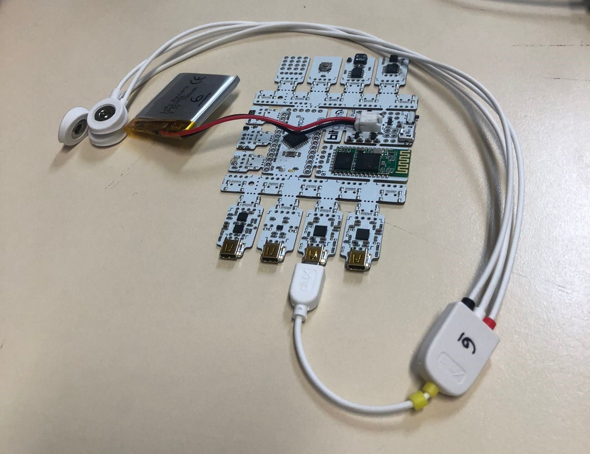
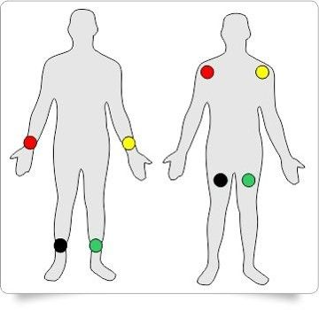
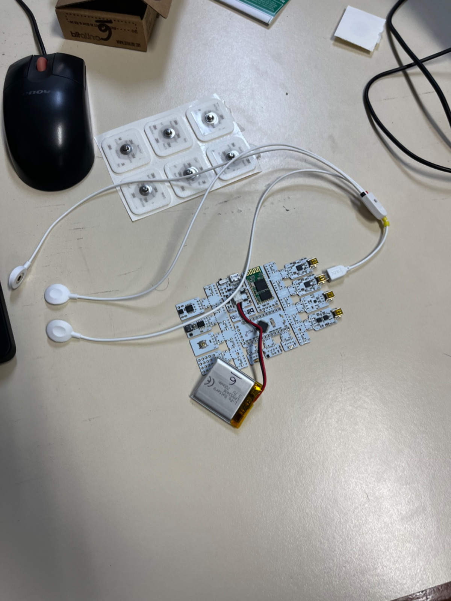
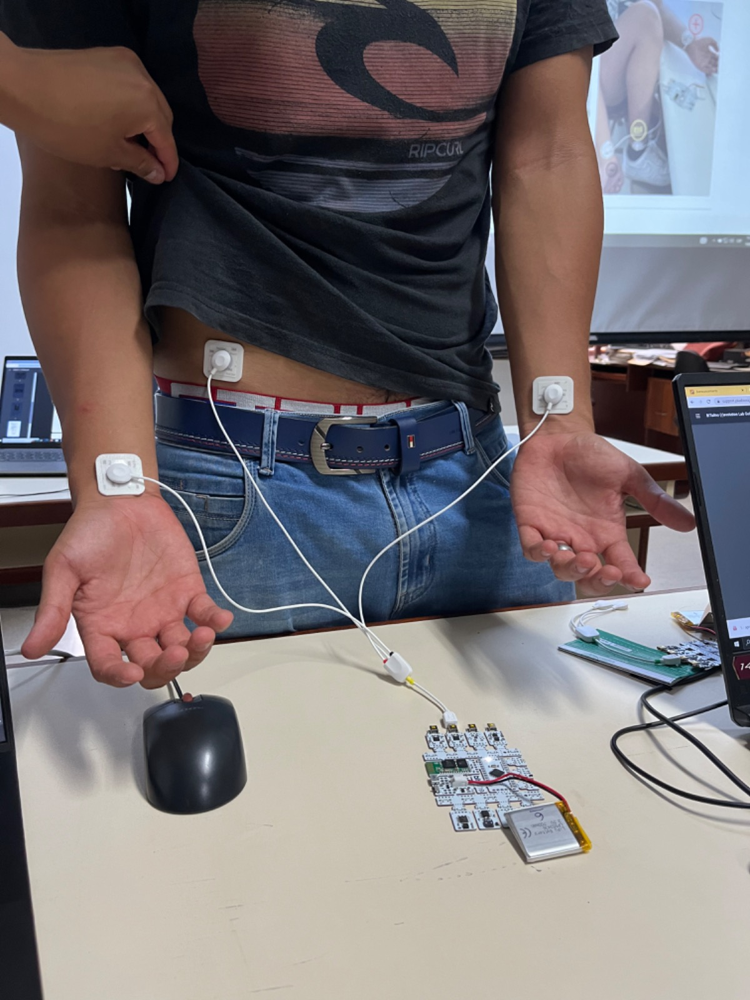
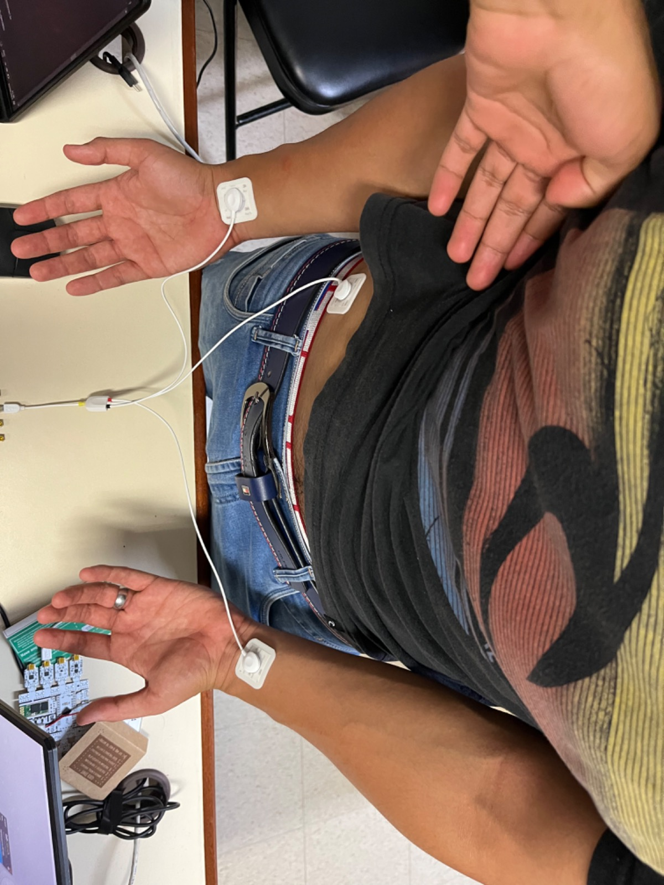
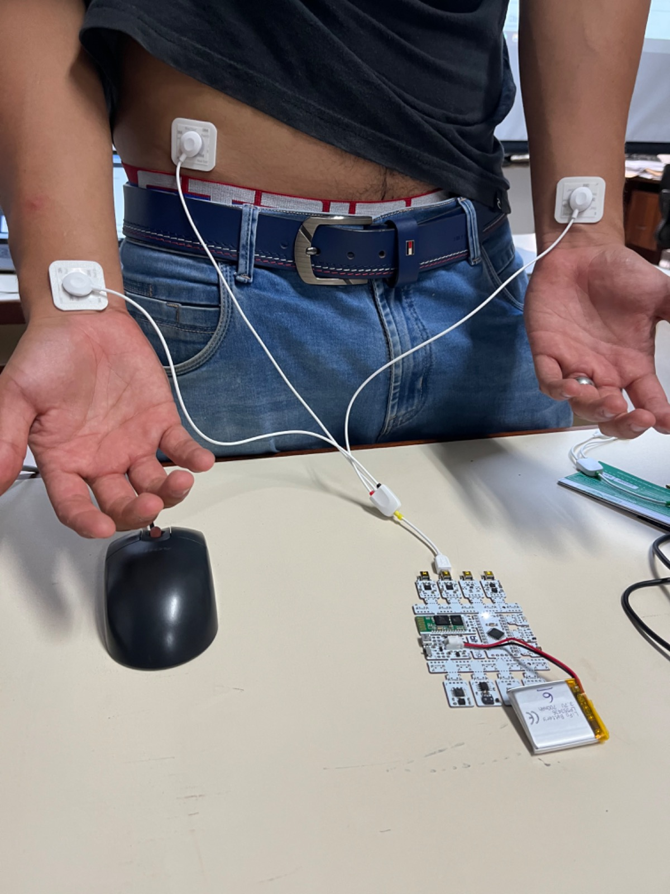
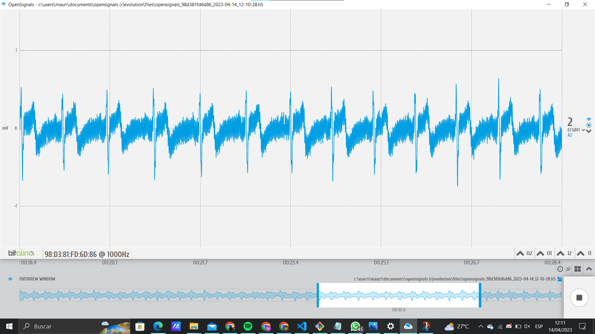
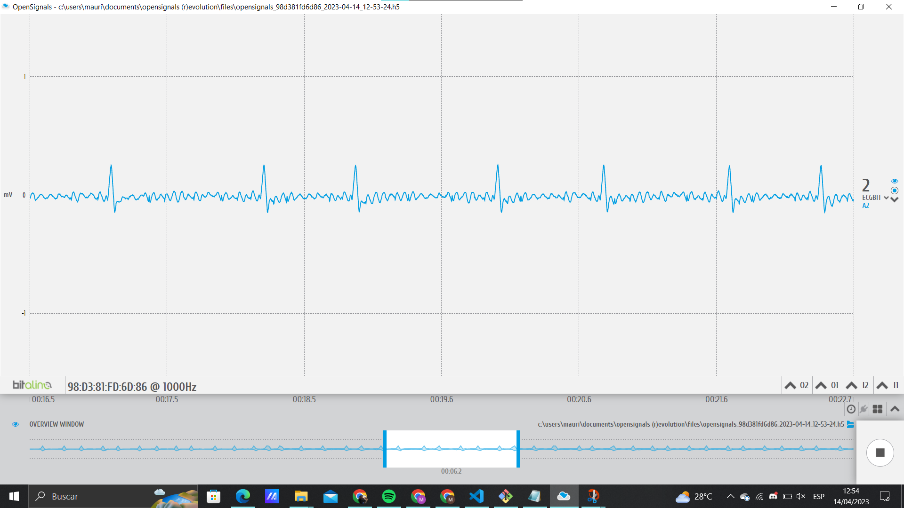

# Entregable de laboratorio 4
#### Laboratorio 4 (14/04/23) - Uso de Bitalino para  ECG

## Tabla de contenidos
---
* [Intregantes](#integrantes)
* [Objetivos](#objetivos)
* [Materiales y Equipos](#materiales-y-equipos)
* [Procedimiento](#procedimiento)
* [Conexiones Usadas](#conexiones-usadas)
* [Señales medidas](#señales-medidas)
* [Ploteos en OpenSignals](#ploteos-en-opensignals)
    * [Archivos](#archivos---opensignals)
* [Resumen y explicación de la señal ploteada](#explicación-de-la-señal-ploteada)
* [Ploteos en Python](#ploteos-en-python)
    * [Archivos](#archivos---python)
* [Bibliografía](#bibliografía)

## Integrantes
---
* Joseph Jesus Melgarejo Castillo -joseph.melgarejo@upch.pe
* Gabriel Adolfo Narvaez Montalvo- gabriel.narvaez@upch.pe
* Mauricio Leonardo Ramos Gallegos -  mauricio.ramos@upch.pe
* Diego Alejandro Celis Matias - diego.celis@upch.pe 
* Ricardo Alonso Muñoz Quiroz- ricardo.munoz@upch.pe

## Objetivos
---
* El objetivo de adquirir señales biomédicas de ECG es obtener mediciones precisas de las señales eléctricas del corazón para evaluar su función y detectar posibles anomalías
* El objetivo de configurar correctamente el dispositivo BiTalino es garantizar que las señales ECG se adquieran de manera óptima, con parámetros adecuados y sin interferencias externas que puedan afectar la precisión de las mediciones.
* El objetivo de extraer información de las señales ECG con el software OpenSignals (r)evolution es procesar y analizar los datos obtenidos de manera eficiente, aplicando herramientas y técnicas adecuadas para visualizar y obtener información relevante de las señales ECG. Esto permite obtener una comprensión más profunda de la función cardíaca y detectar posibles patologías.

## Materiales y equipos
---
| Modelo | Descripción | Cantidad | Referencias |
| :---         |     :---:      |     :---: | ---:|
| (R)EVOLUTION   | Kit BiTalino     | 1    ||
| -     | Laptop o PC       | 1      ||

## Procedimiento

---

## Conceptos utilizados
Como es sabido, para llevar a cabo un ECG . se colocan los electrodos respectivos en distintas puntos estrategicos del cuerpo , como , pecho brazos y piernas. A estos puntos estratégicos se les llamas derivaciones , puntos de registros del corazón que recopilan información de la actividad eléctrica  del corazón desde diferentes ángulos. Dentro de este Laboratorio pudimos comprender en mayor las derivaciones BIPOLARES [2]. Las cuales son:
* La derivación I se coloca en el brazo derecho y en el brazo izquierdo. Esta mide la actividad eléctrica del corazón desde la parte superior izquierda del corazón hacia la parte inferior derecha.

* La derivación II se coloca en el brazo derecho y en la pierna izquierda. Esta mide la actividad eléctrica del corazón desde la parte superior derecha del corazón hacia la parte inferior izquierda.

* La derivación III se coloca en el brazo izquierdo y en la pierna izquierda. Esta miide la actividad eléctrica del corazón desde la parte inferior izquierda del corazón hacia la parte superior derecha.

    

### **Conexiones Usadas**
* BiTalino - Cables
    
Las conexiones que se hicieron en el módulo Bitalino se hicieron en base al manual guía de como se usa bitalino. 

    

* Electrodos - Cuerpo

   

    

    Las conexiones que se hicieron en el primer paciente fueron:

| Zona |Electrodo | Polaridad |
| :---  | :---: | ---:|
| En la muñeca izquierda|Rojo| Positivo|
| En la muñeca derecha |Negro| Negativo |
| Cresta Iliaca|Blanco| Referencia|

|   Vista Superior | Vista Frontal- | 
| :---         |     :---:      |
|   |  |

## Señales medidas

Debemos tomar en cuenta que el estudio se realizo con un sistema bipolar de derivaciones de extremidades el cual se compone de 3 electrodos conectados al módulo ECG del bitalino. Existen distintas formas de conectar estos electrodos, estas son llamadas derivaciones. La derivación I representa la diferencia de potencial entre el brazo derecho y el brazo iquierdo; un impulso eléctrico que se mueve de derecha a izquierda genera una desvicacion de ECG positiva. La derivación II es la diferencia de potencial entre el brazo derecho y la pierna izquierda, se produce una desviación positiva del ECG. Por otro lado la derivación III es la diferencia de potencial entre el brazo y pierna izqueirads, de forma reiterada la dirección del impulso es positivo. La derivacion elegida fue la primera derivación, esta por la facilidad de manejo y longitud de los cables del sensor ECG del bitalino. El caso del paciente 1 se tomo de medida de referencia el tobillo. Por otro lado el paciente 2 tomó la medida de referencia el hueso ileaco de la cadera.
  
---
### **Paciente 1**

 
Electrodos colocados en el paciente 1 

 
Toma de muestra en reposo 

### **Paciente 2**

## Ploteos en OpenSignals
---
**Paciente 1**

<em>
Señal del Paciente 1: Estado Basal
</em>

<em>
Señal del Paciente 1: Aguantando Respiración 10 segundos 
</em>

<em>
Señal del Paciente 1: Después de Ejercicio físico 
</em>

**Paciente2**

<em>
Señal del Paciente 2: Estado Basal 
</em>

<em>
Señal del Paciente 2: Aguantando Respiración 10 segundos 
</em>

<em>
Señal del Paciente 2: Después de Ejercicio físico
</em>

**Señales Simuladas**

<em>
Señal 60 bpm 
</em>

<em>
Señal 120 bpm
</em>

<em>
Señal 240 bpm
</em>

<em>
Señal Enfermedad Cardiovascular : Fibrilación Auricular Severa
</em>

### Archivos - OpenSignals
    
[Señal_Paciente1_Reposo.txt](/Documentaci%C3%B3n/Entregable4/Senal4.txt)

[Señal_Paciente1_10Seg_Respiración.txt](/Documentaci%C3%B3n/Entregable4/Senal5.txt)

[Señal_Paciente1_Ejercicio.txt](/Documentaci%C3%B3n/Entregable4/Senal6.txt)

[Señal_Paciente2_Reposo.txt](/Documentaci%C3%B3n/Entregable4/Senal1.txt)

[Señal_Paciente2_10Seg_Respiración.txt](/Documentaci%C3%B3n/Entregable4/Senal2.txt)

[Señal_Paciente2_Ejercicio.txt](/Documentaci%C3%B3n/Entregable4/Senal3.txt) 

[Señal_60.txt](/Documentaci%C3%B3n/Entregable4/Senal7.txt)

[Señal_120.txt](/Documentaci%C3%B3n/Entregable4/Senal8.txt)

[Señal_240.txt](/Documentaci%C3%B3n/Entregable4/Senal9.txt)

[Señal_Enfermedad Auricular.txt](/Documentaci%C3%B3n/Entregable4/Senal10.txt)

## Explicación de la señal ploteada
---
En las figuras del ECG Basal del participante 1 y 2 se observa que las frecuencias que tiene mayor predominio en la señal están en el rango de 0 a 50 Hz. Un pico inicial en 0 hz pero esto es propio del gráfico, se debe a la continuidad en el tiempo de las señales y la simetría de la gráfica de FFT. Los ruidos encontrados en las señales se pueden mostrar en distintas formas. Una de ellas es el pico en 60 HZ, la cual se debe a las conecciones eléctricas de la misma. Los ECG suelen tener filtros de 25, 50 y 250 hz los cuales evitan estas interferencias o dejan pasar la mayor cantidad de ruido de la mismas para información sobre la respiración o espasmos.

[Más_Información](https://www.flukebiomedical.com/sites/default/files/resources/prosim4_gsspa0300.pdf)

## Ploteos en Python 
---
**Paciente 1**
 

**Paciente 2**
 

### Archivos - Python
 [Ploteos en código Python (https://camo.githubusercontent.com/84f0493939e0c4de4e6dbe113251b4bfb5353e57134ffd9fcab6b8714514d4d1/68747470733a2f2f636f6c61622e72657365617263682e676f6f676c652e636f6d2f6173736574732f636f6c61622d62616467652e737667))

---
