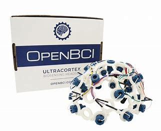

# Hardware
Este riguroso proyecto hará uso de diversos dispositivos para su realización. Se presentará un listado que se irá actualizando durante el transcurso de los entregables.

## Ultracortex Mark IV

 

El Ultracortex "Mark IV" EEG Headset es un dispositivo portátil que se coloca en la cabeza para medir la actividad eléctrica del cerebro y permitir la monitorización y análisis de las ondas cerebrales en tiempo real.

