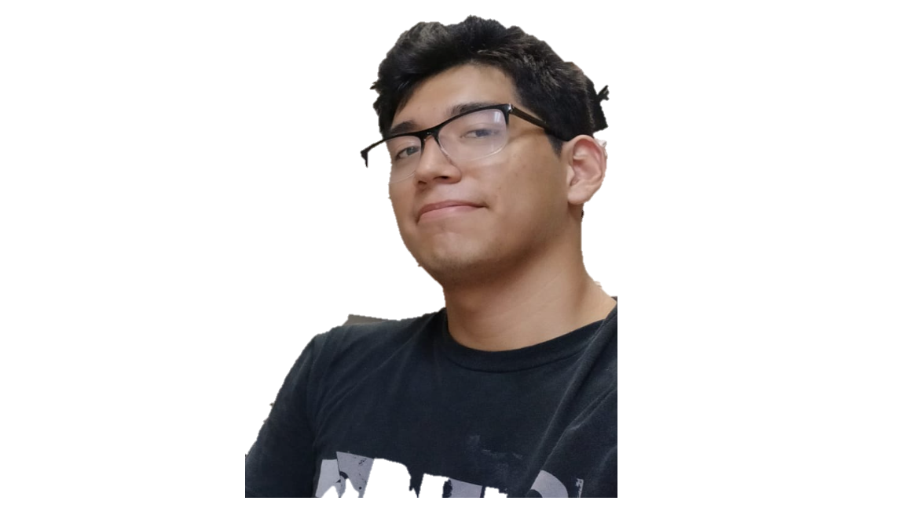
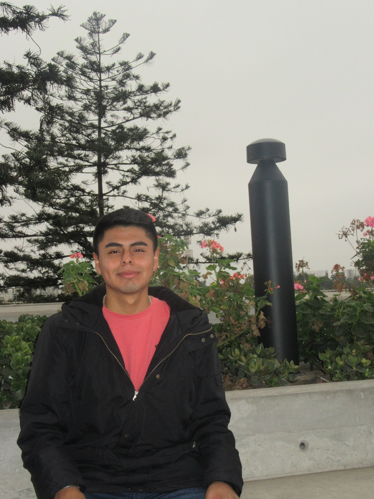
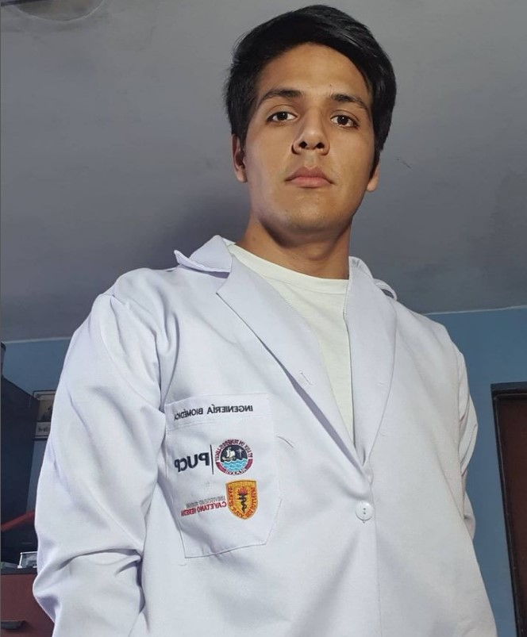
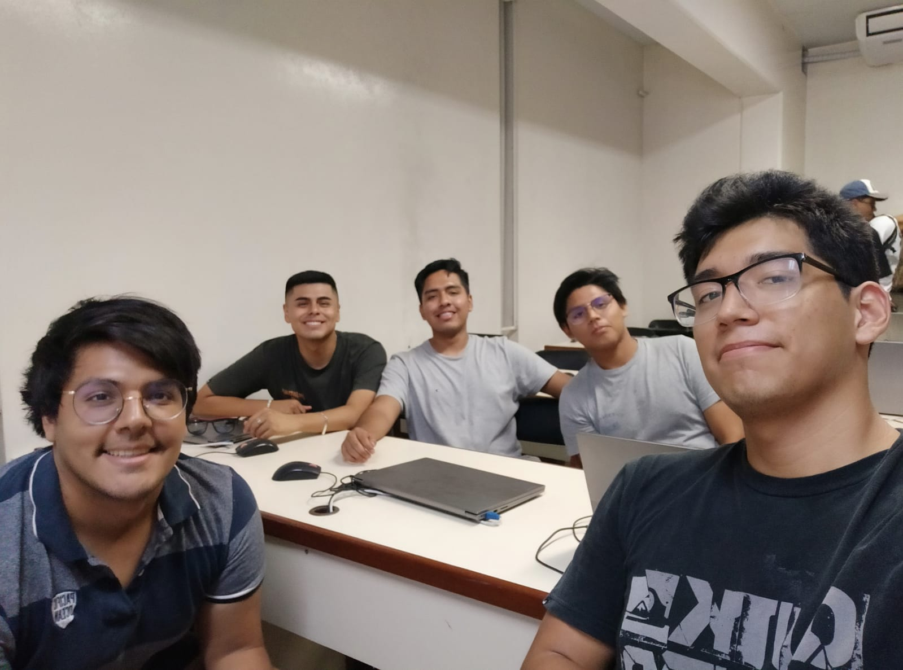

# Sobre Nosotros - Grupo 13

Somos el **Grupo 13** :smile:, estudiantes de la carrera de ingeniería biomédica :dna: :microscope:, del 7mo y 8vo ciclo. 

## Tabla de Contenidos:
* [Intregrantes](#integrantes)
* [Foto Grupal](#presentación-del-grupo-grin)

## Integrantes:
---
- Narvaez Montalvo, Gabriel Adolfo (Colaborador) - gabriel.narvaez@upch.pe\
    Soy Gabriel Narvaez, estudiante de 8vo ciclo de Ingeniería Biomédica. Tengo interes y pasión por la Ingeniería Clínica y Biomécanica enfocada en la rehabilitación.

 

- Ramos Gallegos, Mauricio Leonardo (Colaborador) - mauricio.ramos@upch.pe\
    Soy Mauricio Ramos, estudiante de 7mo ciclo de ingeniería biomédica. Tengo intereses en el Procesamiento de Señales Biomédicas, la bioinformática :man_technologist: y la biomecánica :mechanical_arm:.

 

- Celis Matias, Diego Alejandro (Colaborador) - diego.celis@upch.pe
    Soy Diego Celis, estudiante de noveno ciclo PUCP y UPCH, me considero una persona observadora, calculadora, enfocado en la innovación y la mejora continua con el fin de alcanzar metas; presento un gran sentido de solidaridad por los demás y compartir mis conocimientos con ellos sin obtener nada a cambio. Por esta razón, estoy interesado en el desarrollo de tecnologías para la salud y mejora de la calidad de vida de la persona con énfasis en Ingeniería clínica; y Biomecánica y rehabilitación. Mi propósito es contribuir con el desarrollo de salud pública nacional y mejorar la calidad de vida del país y/o del paciente sin perder el generalismo.

 

- Melgarejo Castillo, Joseph Jesus (Colaborador) - joseph.melgarejo@upch.pe\
    Soy Joseph Melgarejo, estudiante del septimo ciclo de ingeneria Biomedica. Tengo interes en business in health y en health technology.

 

- Muñoz Quiroz, Ricardo Alonso (Colaborador) - ricardo.munoz@upch.pe\
    Soy Ricardo Muñoz, estudiante de 8vo ciclo de Ingeniería Biomédica. Tengo intereces tanto en la metrología como en la Biomecánica y Rehabilitación. Experiencia en Python, Matlab y Visual Basic Application.

 

### Presentación del grupo :grin:

 
