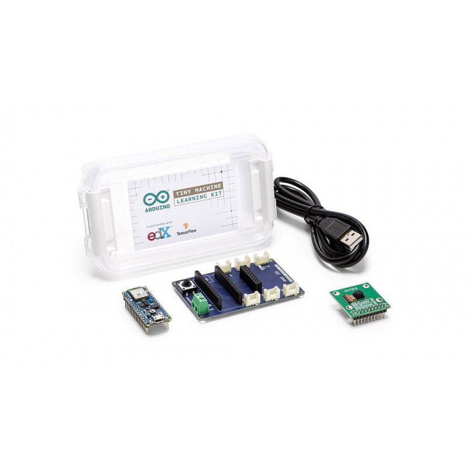

<h1 align="center"> Uso de Kit Arduino TinyML </h1>
Horario 3 - Grupo 13 

Laboratorio 8

## Integrantes

* Joseph Jesus Melgarejo Castillo - joseph.melgarejo@upch.pe
* Gabriel Adolfo Narvaez Montalvo - gabriel.narvaez@upch.pe
* Mauricio Leonardo Ramos Gallegos - mauricio.ramos@upch.pe
* Diego Alejandro Celis Matias - diego.celis@upch.pe 
* Ricardo Alonso Muñoz Quiroz - ricardo.munoz@upch.pe
---
## Tabla de Contenidos
- [Integrantes](#integrantes)
- [Tabla de Contenidos](#tabla-de-contenidos)
- [Objetivos:](#objetivos)
  - [*Materiales y equipos*](#materiales-y-equipos)
- [Conceptos:](#conceptos)
  - [1. Arduino Tiny Machine Learning kit](#1-arduino-tiny-machine-learning-kit)
  - [2. Edge Impulse](#2-edge-impulse)
- [Procedimiento:](#procedimiento)
- [Resultados y Discusión:](#resultados-y-discusión)
- [Referencias](#referencias)

---

## Objetivos:
* Conocer los aspectos básicos del TinyML con el Arduino 33 BLE Sense.
* Explorar la plataforma Edge Impulse.
* Conectar el Arduino nano 33 BLE Sense con Arduino y explorar ejemplos de TinyML.

### *Materiales y equipos*
|Equipo y Materiales |Descripción|Cantidad|
|:---:|:---:|:---:|
|Tiny ML Kit|EL Kit incluye: Arduino nano 33 BLE; Cámara OV7675, Tiny ML Shield y cable USB| 1|
|-|Laptop o PC|1|

---
## Conceptos:
### 1. Arduino Tiny Machine Learning kit
Este es un kit que consta consigo un Arduino Nano 33 BLE Sense, una placa con la capacidad de detectar movimientos, aceleración, rotación, presión barométrica, color, intensidad de luz, entre otras funciones. El kit también incluye un módulo de cámara (OV7675) y un shield personalidad que facilita las conexiones de los componentes y crear con ello un proyecto TinyML. Se puede explorar casos prácticos de uso de Machine Learning utilizando algoritmos clásicos o redes neuronales profundas con la tecnología de TensorFlow Lite Micro [1].

 

### 2. Edge Impulse
Es una plataforma que apoya con los trabajos de desarrollo e implementación de soluciones de Machine Learning en dispositivos de borde ("edge devices").
Esta plataforma proporciona las herramientas necesarias para recopilar datos, entrenar modelos de Machine Learning y desplegarlos en dispositivos de baja potencia, como el Arduino Nano 33 BLE Sensea [2].

 

---
## Procedimiento:
<h3 align> 1. Adquision de imagenes del integrante del equipo Gabriel y Ricardo </h3>

<h3 align> 2. Carga de imagenes de losdos participantes en Edge impluse </h3>   

<h3 align> 3. Creacion  del impulso </h3>

<h3 align> 4. Entrenamiento del modelo </h3>

---
## Resultados y Discusión:
Tras finalizar los pasos previos, se logró desarrollar un modelo de aprendizaje automático en Edge Impulse con la capacidad de reconocer a dos personas distintas con gafas. Sin embargo, el modelo presentó dificultades para identificar correctamente a cada persona, debido a que ambas utilizaban lentes. Estos desafíos se hicieron evidentes al probar el modelo con imágenes de las mismas personas en diferentes condiciones de iluminación y fondo. Es importante tener en cuenta que la precisión y el rendimiento del modelo pueden variar según la calidad de las imágenes utilizadas en el entrenamiento y la cantidad de datos disponibles.
Además de los desafíos mencionados anteriormente, otro factor importante que influyó en el rendimiento del modelo de reconocimiento facial fue el uso de lentes por parte de las personas. En particular, la presencia de lentes puede afectar la forma en que se capturan y procesan los colores en las imágenes.

El modelo de reconocimiento facial utiliza la información de color de las imágenes para identificar y distinguir características faciales clave. Sin embargo, los lentes pueden alterar la forma en que la luz se refleja y se transmite a través de ellos, lo que puede afectar la apariencia y la precisión de los colores capturados en las imágenes.

En particular, los lentes de color o con recubrimientos especiales, como los lentes polarizados o los lentes de protección UV, pueden afectar la distribución de los colores en la imagen. Esto puede llevar a una representación incorrecta de los colores faciales y dificultar la identificación precisa de las personas en el modelo de reconocimiento facial.

Por lo tanto, es importante tener en cuenta estas variaciones y considerar factores como el tipo de lentes utilizados por las personas al entrenar y evaluar modelos de reconocimiento facial. Además, es recomendable capturar imágenes en diferentes condiciones de iluminación y fondos para tener una representación más completa y robusta de las características faciales de las personas con lentes.

*Foto 2: Resultados de prueba, primer usuario*

*Foto 3: Resultados de prueba, segundo usuario*

*Foto 4: Usuario 1*

*Foto 5: Computadora usada para la adquisición de datos y pruebas*

*Foto 6: Usuario 2*

## Referencias
---
[1] Arduino nano 33 ble sense,” Arduino Online Shop, https://store-usa.arduino.cc/products/arduino-nano-33-ble-sense (accessed Jun. 23, 2023).
 [Enlace sobre Arduino 33 BLE Sense](https://docs.arduino.cc/hardware/nano-33-ble-sense) 

[2] Edge Impulse, [https://studio.edgeimpulse.com/studio/240546](https://studio.edgeimpulse.com/studio/240546)

[3] Teachable Machine. Available: [https://teachablemachine.withgoogle.com/models/W7tLJMBc8/](https://teachablemachine.withgoogle.com/models/W7tLJMBc8/)
