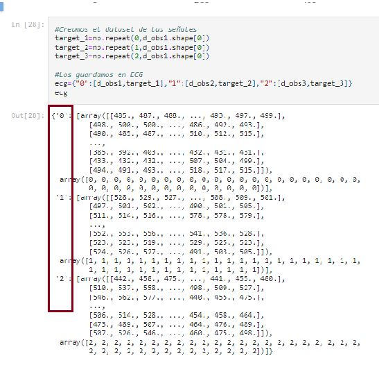

<h1 align="center"> Creacion de data tabular a partir de las señales fisiologicas previamente adquiridas </h1>
Horario 3 - Grupo 13 

Laboratorio 6 

## Integrantes

* Joseph Jesus Melgarejo Castillo -joseph.melgarejo@upch.pe
* Gabriel Adolfo Narvaez Montalvo- gabriel.narvaez@upch.pe
* Mauricio Leonardo Ramos Gallegos -  mauricio.ramos@upch.pe
* Diego Alejandro Celis Matias - diego.celis@upch.pe 
* Ricardo Alonso Muñoz Quiroz- ricardo.munoz@upch.pe
---
## Tabla de Contenidos
* [Introducción](#introducción)
* [¿Por qué trabajar con datasets](#¿Por-qué-trabajar-con-datasets?)
* [Dataset](#Dataset)
---     

## ¿Por qué trabajar con datasets?
Tipos de estructuras conocidas para el manejo de señales en Python.

1. **Arrays:** son estructuras de datos que permiten almacenar datos numéricos en forma de matrices. Son muy utilizados en el procesamiento de imágenes y señales.
2. **Data Frames:** son estructuras de datos tabulares, similares a las hojas de cálculo. Permiten trabajar con datos estructurados y realizar operaciones de filtrado, agregación y transformación.
3. **Series:** son estructuras de datos unidimensionales, similares a los arrays, pero con etiquetas en los ejes. Son útiles para trabajar con datos de series temporales.
4. **Tensores:** son estructuras de datos multidimensionales, similares a los arrays, pero con una capacidad mayor para almacenar datos de diferentes dimensiones. Son muy utilizados en el procesamiento de imágenes y en el aprendizaje profundo.

Estas estructuras de datos son muy útiles para trabajar con machine learning en Python, ya que permiten manejar grandes cantidades de datos y realizar operaciones complejas de manera eficiente.

En este caso, debido a la base de los integrantes del curso solo se conocen los arrays y los data frames. A manera de facilitar la adquisición de valores máximos, mínimos y plotear de manera sencilla en base a arreglos de datos específicos de cada paciente se trabajará además con **Pandas**, el cual permitirá agilizar el uso de Data Frames y agilizar la gestión del mismo. Este proceso es necesario para un futuro acercamiento en machine learning y manejo de grandes cantidades de data que serán adquiridas o trabajadas para el proyecto del curso.

## Dataset
Dentro del grupo esta semana se tuvieron algunas discrepancias en cuanto al tipo de dataset que tendríamos que tener para el correcto trabajo de las señales por lo que buscamos feedback del profesor y se hicieron 2 tipos de datasets finales. 

Labels  a usar: 

- 0 : basal
- 1 : respiración
- 2 :  ejercicio

**********************Comparación:**********************

La estructura del primer dataset consta de un solo array que contenga todo en un solo label el tipo de señal o la clasificación de la misma. Sin embargo, en el segundo tipo de dataset contiene 3 tipos de array que contienen los labels del tipo de señal adquirida.

* [Paciente1](https://github.com/JosephJesus24/GrupoSe-ales/blob/1ef70b85704a4b0131ad54f3e17c52475e21076d/ISB/6.%20Data%20Tabular%20ECG/Data%20tabular%20ECG%20-%20Paciente%201%20(Ricardo).ipynb)

 

* [Paciente2](https://github.com/JosephJesus24/GrupoSe-ales/blob/1ef70b85704a4b0131ad54f3e17c52475e21076d/ISB/6.%20Data%20Tabular%20ECG/Data%20tabular%20ECG%20-%20Paciente%202%20(Diego).ipynb)

 

