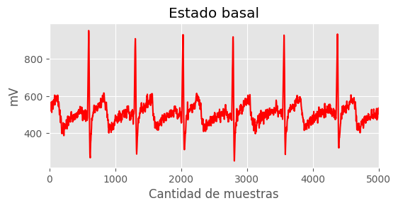
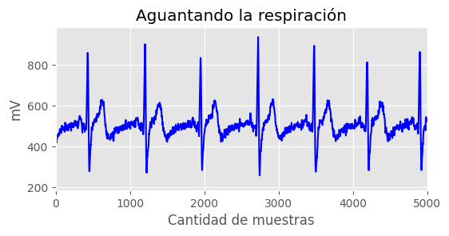

<h1 align="center"> Filtros IIR y FIR </h1>
Horario 3 - Grupo 13 

Laboratorio 7

## Integrantes

* Joseph Jesus Melgarejo Castillo-joseph.melgarejo@upch.pe
* Gabriel Adolfo Narvaez Montalvo-gabriel.narvaez@upch.pe
* Mauricio Leonardo Ramos Gallegos-mauricio.ramos@upch.pe
* Diego Alejandro Celis Matias-diego.celis@upch.pe 
* Ricardo Alonso Muñoz Quiroz-ricardo.munoz@upch.pe
---
## Tabla de Contenidos
1. [Conceptos](#Conceptos)
2. [Procedimiento](#procedimiento)
3. [Referencias](#referencias)

## Conceptos

### Que es un filtro?

En términos generales, un filtro es un dispositivo, circuito o algoritmo digital que se utiliza para procesar una señal y producir una salida que tiene ciertas características deseables. Los filtros se utilizan en una amplia variedad de aplicaciones, como la electrónica de audio, la comunicación inalámbrica, el procesamiento de señales biomédicas, la ingeniería de control y muchos otros campos de la ingeniería. [1]

Un filtro funciona mediante la eliminación o atenuación de ciertas frecuencias de la señal de entrada, mientras que permite que otras frecuencias pasen sin cambios. Esto se logra mediante el uso de componentes electrónicos como resistencias, capacitores e inductores, que forman una red que altera el espectro de frecuencia de la señal. Esta serie de componentes puede ser además simulada por algoritmos lógicos que puedan tratar señales. [2]

### Filtro activo
Un filtro activo es un tipo de filtro que utiliza componentes activos como amplificadores operacionales, transistores o amplificadores de instrumentación para mejorar sus características de filtrado. A diferencia de los filtros pasivos, que utilizan componentes pasivos como resistencias, capacitores e inductores, los filtros activos pueden proporcionar una mayor precisión y un mayor control en la respuesta de frecuencia. [2]

La principal ventaja de los filtros activos es su capacidad para amplificar la señal mientras se filtra, lo que permite una mayor eficiencia y precisión en la señal de salida. Además, los filtros activos pueden ser diseñados para tener una respuesta de frecuencia más nítida y precisa, lo que los hace ideales para aplicaciones que requieren una alta precisión de filtrado.

### Clasificacion de los filtros activos (Segun su aproximacion matematica) 

1. Filtros de aproximación de Butterworth: Estos filtros están diseñados para proporcionar una respuesta de frecuencia lo más plana posible en la banda de paso y una rápida caída de la amplitud en la banda de rechazo. Los filtros Butterworth se caracterizan por una transición suave entre la banda de paso y la banda de rechazo y se utilizan comúnmente en aplicaciones de audio y en sistemas de control. [2]

2. Filtros de aproximación de Chebyshev: Estos filtros proporcionan una mayor atenuación en la banda de rechazo que los filtros Butterworth, a costa de una respuesta de frecuencia con oscilaciones en la banda de paso. Los filtros Chebyshev se utilizan comúnmente en aplicaciones de telecomunicaciones y en sistemas de control. [2]

3. Filtros de aproximación de Bessel: Estos filtros se caracterizan por una respuesta de fase lineal en la banda de paso, lo que significa que no se producen distorsiones en el tiempo de las señales de entrada. Los filtros Bessel se utilizan comúnmente en aplicaciones de instrumentación y en sistemas de control. [2]

4. Filtros de aproximación elíptica: Estos filtros proporcionan una atenuación extremadamente alta en la banda de rechazo, a costa de una respuesta de frecuencia con oscilaciones tanto en la banda de paso como en la banda de rechazo. Los filtros elípticos se utilizan comúnmente en aplicaciones de radiofrecuencia y en sistemas de telecomunicaciones. [2]

###  Filtro Digital

Un filtro digital es un tipo de filtro que utiliza técnicas de procesamiento digital de señales para filtrar una señal analógica o digital. En lugar de utilizar componentes electrónicos analógicos, como resistencias, capacitores e inductores, los filtros digitales utilizan algoritmos matemáticos para procesar y filtrar la señal de entrada. [2] Matemáticamente es una herramienta muy útil, permiten el manejo con mayor grados de libertad que otros métodos con el único inconveniente de la frecuencia procesamiento. La velocidad de funcionamiento del filtro se ve afectada por la potencia computacional.

La señal de entrada se convierte en una señal digital mediante un convertidor analógico-digital, y luego se aplica un algoritmo de filtrado digital para filtrar la señal. Los filtros digitales pueden ser implementados en hardware mediante procesadores digitales de señales (DSP) o en software mediante algoritmos de procesamiento de señales en una computadora.

### Clasificacion de filtros digitales

1-Filtros FIR: Los filtros FIR (Finite Impulse Response, en inglés) tienen una respuesta finita al impulso y se caracterizan por una respuesta de fase lineal. Estos filtros se diseñan utilizando una respuesta de impulso finita y son ideales para aplicaciones en las que se requiere una respuesta de fase lineal y una alta precisión en el filtrado de señales. Los filtros FIR se pueden implementar utilizando convolución y su diseño es relativamente sencillo. [2]

2-Filtros IIR: Los filtros IIR (Infinite Impulse Response, en inglés) tienen una respuesta infinita al impulso y se caracterizan por una respuesta de fase no lineal. Estos filtros se diseñan utilizando una retroalimentación de la salida al filtro y son ideales para aplicaciones en las que se requiere una alta selectividad y una respuesta de frecuencia no lineal. Los filtros IIR son más complejos de diseñar y pueden presentar problemas de estabilidad, por lo que se requiere una atención cuidadosa durante su diseño. Ante esta problemática los IIR digitales ayudan a la practicidad.[2]

## Procedimiento

Para la realización del filtrado de las señales se hizo uso de los archivos .txt recopilados durante la adiquisición de las señales ECG.

[Señal Basal](C%C3%B3digos%20de%20filtrado/Basal_pac1.txt)

[Señal Respiracion](C%C3%B3digos%20de%20filtrado/Respiracion_pac1.txt)

[Señal Post Ejercicio](C%C3%B3digos%20de%20filtrado/Post_ejercicio_pac1.txt)

Las señales usadas fueron del paciente 1, y para la recopilación de las señales se hizo el mismo procedimiento para la creación de la Dataset.

Los archivos .txt se convirtieron en arrays con el uso de la librería numpy, además de ello se hizo un recorte de la señal cada una para que puedan ser sampleadas con una frecuencia de 1000 muestras.

 

Primero hicimos un análisis en frecuencia de la señal de estado basal para comprender las posibles frecuencias de ruido que encontremos en esta señal.

Podemos ver que solo apreciamos frecuencias menores a 60Hz.

Se hizo uso de dos tipos de Filtros IIR (Filtro Butterwoth) y FIR (Filtro Hamming) y se obtuevieron estos resultados: 

[Notebook de las señales ECG filtradas](C%C3%B3digos%20de%20filtrado/FiltroPaciente1.ipynb)

 

| Campo | Señal cruda | Filtro IIR |  Filtro FIR  |
| :---         |     :---:      |      :---:      | :---         |
| Reposo         || ||
| Respiración aguantada | |  | |
| Post Ejercicio     | | ||    

---
Se realizaron cambios en el notebook de los filtros:
Se utilizó el dataset del entregable 6 y se filtro desde ahí.

[Filtros IIR y FIR](Filtros.ipynb)

## Referencias
1. Willis J. Tompkins. Biomedical digital signal procesing.Prentice Hall,
may, 1993. 
2. J. G. Proakis, "Digital Signal Processing Using MATLAB: A Problem Solving Companion ," Cengage Learning, 2019.
3. Digital signal processing toolbox. The MathWorks Inc., 1992-2001.
4. J. G., Proakis, Dimitris G. Manolakis. Tratamiento digital de señales.
Prentice Hall, 1997
