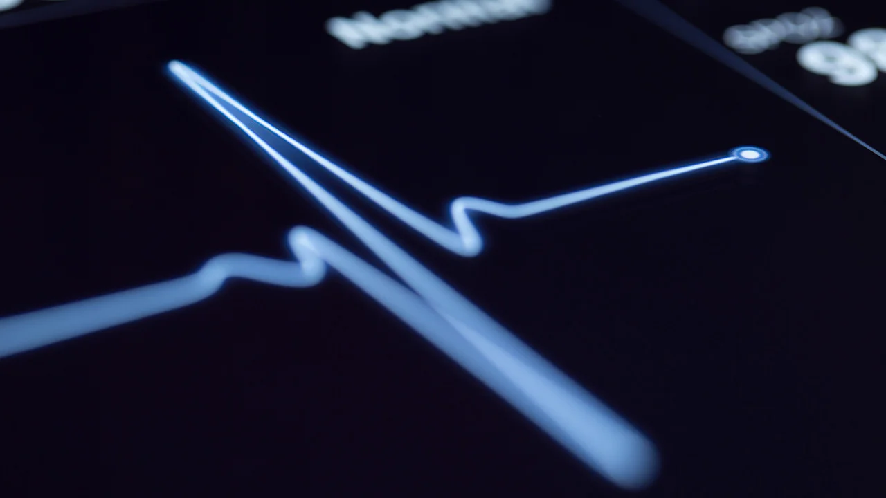
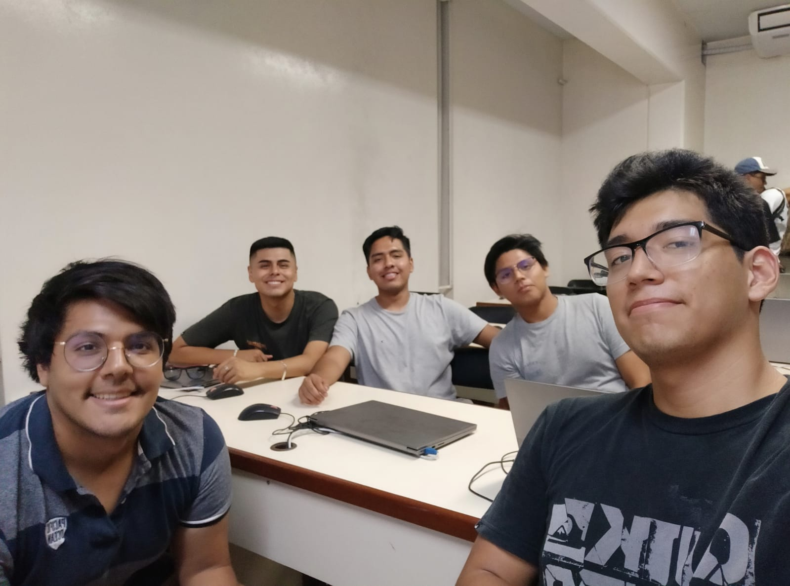

# Introducción a Señales Biomédicas Grupo 13

Bienvenidos al repositorio del Grupo 13 para el curso de *Introducción a Señales Biomédicas*. Somos el **Grupo 13** :smile:, estudiantes de la carrera de ingeniería biomédica :dna: :microscope:, del 7mo ciclo. 

## Tabla de Contenidos:
* [¿Qué es una señal Biomédica?](#¿qué-es-una-señal-biomédica)
* [Materiales](#materiales)
* [Intregrantes](#integrantes)
* [Bibliografía](#bibliografía)

## ¿Qué es una Señal Biomédica?
---
Se conoce como una señal a una representación en función del tiempo de un fenómeno físico que permite obtener una información sobre la fuente que la generó[1].\

¿Una Señal Biomédica son señales generadas por diferentes sistemas fisiológicos del cuerpo humano. Su captación permite extraer el funcionamiento de los órganos y con ellos se podrán emitir algún diagnóstico[1].\

Son de muy baja potencial eléctrico (en el orden de los mV) y están siempre sometidas a ruidos, esto perjudica su análisis y observación por parte del personal médico, por lo que para ello es necesario el uso de técnicas de Procesamiento de señales y la aplicación de filtros digitales para su diagnóstico[2].

## Materiales:
---
|Material    | Descripción  | Imagen |
| ---------- |:------------:|-------:|
|**Arduino Nano 33 IoT**| Es una placa de desarrollo que integra capacidades de conectividad inalámbrica, procesamiento de datos y sensores, diseñanada para proyectos de Internet de las cosas (IoT) que requieren baja potencia y alta eficiencia energética. Es una placa de desarrollo que integra capacidades de conectividad inalámbrica, procesamiento de datos y sensores, diseñanada para proyectos de Internet de las cosas (IoT) que requieren baja potencia y alta eficiencia energética.| 
|**Arduino Tiny Machine Learning Kit**| es un paquete de hardware y software que permite a los usuarios implementar aprendizaje automático en dispositivos pequeños y de bajo consumo de energía, utilizando la plataforma Arduino y Edge Impulse||
||||

## Integrantes:
---
- Narvaez Montalvo, Gabriel Adolfo (Colaborador) - gabriel.narvaez@upch.pe\
    Soy Gabriel Narvaez, estudiante de 8vo ciclo de Ingeniería Biomédica. Tengo interes y pasión por la Ingeniería Clínica y Biomécanica enfocada en la rehabilitación
     
- Ramos Gallegos, Mauricio Leonardo (Colaborador) - mauricio.ramos@upch.pe\
    Soy Mauricio Ramos, estudiante de 7mo ciclo de ingeniería biomédica. Tengo intereses en el Procesamiento de Señales Biomédicas, la bioinformática :man_technologist: y la biomecánica :mechanical_arm:. 
 
- Celis Matias, Diego Alejandro (Colaborador) -
- Melgarejo Castillo, Joseph Jesus (Colaborador) -
- Muñoz Quiroz, Ricardo Alonso (Colaborador) -

### Presentación del grupo :grin:

## Bibliografía:
---
[1]	J. F. Guerrero Martínez, [“INGENIERÍA BIOMÉDICA Tema 2 Bioseñales 2.1. Introducción”](http://ocw.uv.es/ingenieria-y-arquitectura/1-5/ib_material/IB_T2_OCW.pdf), 2010.\
[2]	C. Sánchez Márquez, [“PROCESAMIENTO DE SEÑALES BIOMÉDICAS MEDIANTE INSTRUMENTO VIRTUAL DESARROLLADO CON MATLAB Biomedical Signal Processing Using Virtual Instrument developed with Matlab”](https://repositorio.upn.edu.pe/bitstream/handle/11537/2996/Procesamiento%20de%20se%C3%B1ales%20biom%C3%A9dicas.pdf?sequence=1#:~:text=Las%20se%C3%B1ales%20biom%C3%A9dicas%2C%20tales%20como,el%20an%C3%A1lisis%20m%C3%A9dico%20del%20paciente%20).
 
