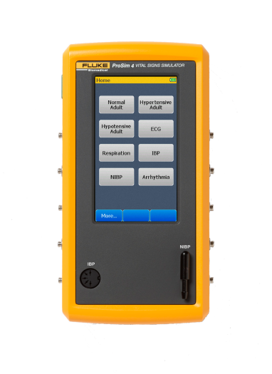

# Introducción a Señales Biomédicas Grupo 13

Bienvenidos al repositorio del Grupo 13 para el curso de *Introducción a Señales Biomédicas*. Somos el **Grupo 13** :smile:, estudiantes de la carrera de ingeniería biomédica :dna: :microscope:, del 7mo y 8vo ciclo. 

## Tabla de Contenidos:
* [¿Qué es una señal Biomédica?](#¿qué-es-una-señal-biomédica)
* [Materiales](#materiales)
* [Intregrantes](#integrantes)
* [Bibliografía](#bibliografía)

## ¿Qué es una Señal Biomédica?
---
Se conoce como una señal a una representación en función del tiempo de un fenómeno físico que permite obtener una información sobre la fuente que la generó[1].\

Una Señal Biomédica son señales generadas por diferentes sistemas fisiológicos del cuerpo humano. Su captación permite extraer el funcionamiento de los órganos y con ellos se podrán emitir algún diagnóstico[1].\

Son de muy bajo potencial eléctrico (en el orden de los mV) y están siempre sometidas a ruidos, esto perjudica su análisis y observación por parte del personal médico, por lo que para ello es necesario el uso de técnicas de Procesamiento de señales y la aplicación de filtros digitales para su diagnóstico[2].

## Materiales:
---
|Material    | Descripción  | Imagen |
| ---------- |:------------:|-------:|
|**Arduino Nano 33 IoT**| Es una placa de desarrollo que integra capacidades de conectividad inalámbrica, procesamiento de datos y sensores, diseñanada para proyectos de Internet de las cosas (IoT) que requieren baja potencia y alta eficiencia energética. Es una placa de desarrollo que integra capacidades de conectividad inalámbrica, procesamiento de datos y sensores, diseñanada para proyectos de Internet de las cosas (IoT) que requieren baja potencia y alta eficiencia energética.| 
|**Arduino Tiny Machine Learning Kit**| es un paquete de hardware y software que permite a los usuarios implementar aprendizaje automático en dispositivos pequeños y de bajo consumo de energía, utilizando la plataforma Arduino y Edge Impulse.||
|**ULTRACORTEX "MARK IV" EEG HEADSET**|El Ultracortex "Mark IV" EEG Headset es un dispositivo portátil que se coloca en la cabeza para medir la actividad eléctrica del cerebro y permitir la monitorización y análisis de las ondas cerebrales en tiempo real.||
|**ProSim 4 Vital Signs Patient Simulator**|Fluke ProSim 4 Vital Signs Patient Simulator es un simulador de paciente que imita los signos vitales del paciente, como la presión arterial, la frecuencia cardíaca y la respiración, para ayudar en el entrenamiento y prueba de equipos médicos.||
|**BITalino (r)evolution Board Kit BLE/BT**|BITalino es un kit de herramientas de prototipado rápido para proyectos de salud y bienestar personal. Incluye sensores inalámbricos y una plataforma de software para adquirir, procesar y visualizar datos biomédicos.||

## Integrantes:
---
- Narvaez Montalvo, Gabriel Adolfo (Colaborador) - gabriel.narvaez@upch.pe\
    Soy Gabriel Narvaez, estudiante de 8vo ciclo de Ingeniería Biomédica. Tengo interes y pasión por la Ingeniería Clínica y Biomécanica enfocada en la rehabilitación

- Ramos Gallegos, Mauricio Leonardo (Colaborador) - mauricio.ramos@upch.pe\
    Soy Mauricio Ramos, estudiante de 7mo ciclo de ingeniería biomédica. Tengo intereses en el Procesamiento de Señales Biomédicas, la bioinformática :man_technologist: y la biomecánica :mechanical_arm:. 
 
- Celis Matias, Diego Alejandro (Colaborador) - diego.celis@upch.pe
    Soy Diego Celis, estudiante de noveno ciclo PUCP y UPCH, me considero una persona observadora, calculadora, enfocado en la innovación y la mejora continua con el fin de alcanzar metas; presento un gran sentido de solidaridad por los demás y compartir mis conocimientos con ellos sin obtener nada a cambio. Por esta razón, estoy interesado en el desarrollo de tecnologías para la salud y mejora de la calidad de vida de la persona con énfasis en Ingeniería clínica; y Biomecánica y rehabilitación. Mi propósito es contribuir con el desarrollo de salud pública nacional y mejorar la calidad de vida del país y/o del paciente sin perder el generalismo.

- Melgarejo Castillo, Joseph Jesus (Colaborador) - 
joseph.melgarejo@upch.pe\
    Soy Joseph Melgarejo, estudiante del septimo ciclo de ingeneria Biomedica. Tengo interes en business in health y en health technology.
 
- Muñoz Quiroz, Ricardo Alonso (Colaborador) - ricardo.munoz@upch.pe\
    Soy Ricardo Muñoz, estudiante de 8vo ciclo de Ingeniería Biomédica. Tengo intereces tanto en la metrología como en la Biomecánica y Rehabilitación. Experiencia en Python, Matlab y Visual Basic Application.
 

### Presentación del grupo :grin:

## Bibliografía:
---
[1]	J. F. Guerrero Martínez, [“INGENIERÍA BIOMÉDICA Tema 2 Bioseñales 2.1. Introducción”](http://ocw.uv.es/ingenieria-y-arquitectura/1-5/ib_material/IB_T2_OCW.pdf), 2010.\
[2]	C. Sánchez Márquez, [“PROCESAMIENTO DE SEÑALES BIOMÉDICAS MEDIANTE INSTRUMENTO VIRTUAL DESARROLLADO CON MATLAB Biomedical Signal Processing Using Virtual Instrument developed with Matlab”](https://repositorio.upn.edu.pe/bitstream/handle/11537/2996/Procesamiento%20de%20se%C3%B1ales%20biom%C3%A9dicas.pdf?sequence=1#:~:text=Las%20se%C3%B1ales%20biom%C3%A9dicas%2C%20tales%20como,el%20an%C3%A1lisis%20m%C3%A9dico%20del%20paciente%20).
 
