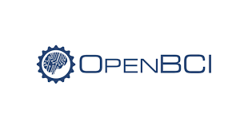

# Softwares
Este riguroso proyecto hará uso de diversos softwares para su realización. Se presentará un listado que se irá actualizando durante el transcurso de los entregables.

## OpenBCI

 

El software OpenBCI es un programa de fácil uso y muy versatil para la visualización de bioseñales en tiempo real, este será un complemento para el dispositivo BiTalino que tendrá el objetivo de medir las bioseñales necesitadas.